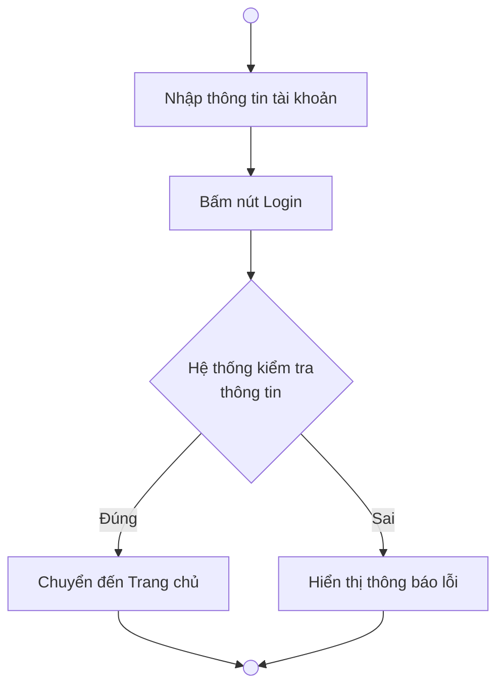

# Sơ đồ hoạt động (Activity Diagram) - Usecase Đăng nhập

```mermaid
flowchart TD
    %% Điểm bắt đầu
    Start(( )) --> InputAcc[Nhập thông tin tài khoản]
    
    %% Thao tác người dùng
    InputAcc --> ClickLogin[Bấm nút Login]
    
    %% Xử lý hệ thống
    ClickLogin --> CheckInfo{Hệ thống kiểm tra\nthông tin}
    
    %% Luồng rẽ nhánh
    CheckInfo -- Đúng --> GoHome[Chuyển đến Trang chủ]
    CheckInfo -- Sai --> ShowError[Hiển thị thông báo lỗi]
    
    %% Điểm kết thúc
    GoHome --> End(( ))
    ShowError --> End
```
Extension